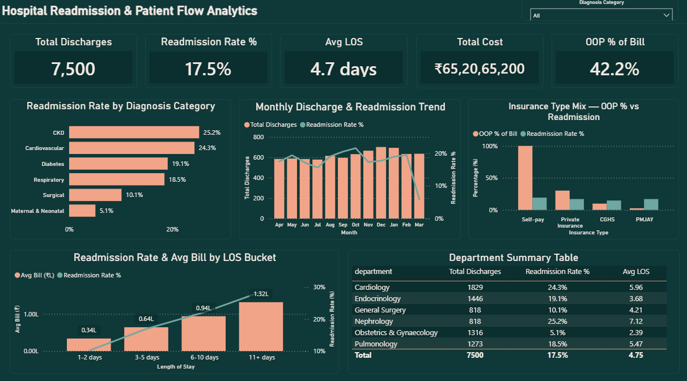
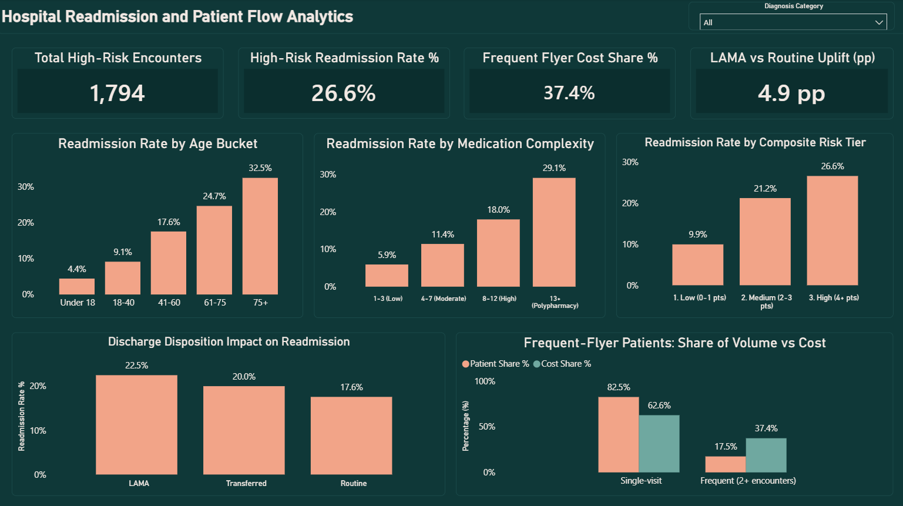

# Hospital Readmission & Patient Flow Analytics

A comprehensive healthcare analytics portfolio project analyzing 30-day hospital readmission drivers, patient flow dynamics, and cost concentration across 9,093 hospital encounters.

[](https://www.python.org/)
[](https://pandas.pydata.org/)
[](https://numpy.org/)
[](https://matplotlib.org/)
[](https://seaborn.pydata.org/)  
[](https://www.microsoft.com/sql-server)
[](https://en.wikipedia.org/wiki/SQL)
[](https://powerbi.microsoft.com/)
[](https://learn.microsoft.com/dax/)  
[](https://git-scm.com/)
[](https://github.com/tanyaverma20/Hospital-Readmission-Patient-Flow-Analytics)

---

## Project Overview

Hospital readmissions within 30 days of discharge impact patient health outcomes and strain healthcare financial resources. This project explores inpatient care patterns, length of stay (LOS), patient demographic profiles, and financial liability across a synthetic hospital dataset representing a multispecialty facility in Gurugram (Delhi-NCR) for FY 2024-25.

By combining **Python** (synthetic data generation, data hygiene, and exploratory data analysis), **SQL Server** (relational schemas, window functions, and business queries), and **Power BI** (star-schema modeling, DAX measures, and interactive reporting), this project provides actionable visibility into high-risk clinical segments and operational cost drivers to support targeted discharge planning and bed management.

---

## Business Problem

Without structured operational and clinical analytics, hospital administrators and discharge coordination teams face critical challenges:

- **Unidentified Readmission Drivers:** Lack of visibility into which diagnosis categories, age segments, and clinical complexities correlate most strongly with 30-day bounce-backs.
- **Patient Flow & Stay Duration:** Determining whether premature discharge (short stays) or elevated clinical acuity (extended stays) drives readmissions, and quantifying the associated bed-day utilization.
- **Financial & Out-of-Pocket Burden:** Understanding how out-of-pocket (OOP) payment burden varies across health coverage programs (PMJAY, CGHS, Private Insurance, Self-pay) and assessing its relationship with follow-up adherence and return visits.
- **Cost Concentration:** Evaluating whether a small subset of repeat encounters ("frequent flyers") accounts for a disproportionate share of total inpatient billing.
- **Actionable Risk Stratification:** Establishing a simple, transparent risk-scoring heuristic at discharge to prioritize post-discharge interventions without requiring black-box architectures.

---

## Solution Workflow

```
Synthetic Inpatient Dataset
|
v
Python Data Generation & Preprocessing (generate_data.py)
|
v
Python Data Quality Checks, EDA & Feature Engineering (eda.py)
|
v
Relational Modeling & SQL Analytics
(01_create_tables.sql | 02_business_questions.sql)
|
v
Power BI Relational Data Model
|
v
DAX Measure Development
|
v
Interactive 2-Page Executive & Risk Driver Dashboard
|
v
Operational Insights & Targeted Discharge Recommendations
```

---

## Tech Stack

[](https://www.python.org/)
[](https://pandas.pydata.org/)
[](https://numpy.org/)
[](https://matplotlib.org/)
[](https://seaborn.pydata.org/)  
[](https://www.microsoft.com/sql-server)
[](https://en.wikipedia.org/wiki/SQL)
[](https://powerbi.microsoft.com/)
[](https://learn.microsoft.com/dax/)  
[](https://git-scm.com/)
[](https://github.com/tanyaverma20/Hospital-Readmission-Patient-Flow-Analytics)

| Technology | Usage |
|---|---|
| **Python** | Data simulation, pipeline orchestration, exploratory data analysis |
| **Pandas** | Tabular data manipulation, time-window aggregations, data profiling |
| **NumPy** | Statistical distributions (Gamma, Poisson, Normal), vector calculations, sigmoid probability formulation |
| **Matplotlib** | Static visualization of feature distributions and analytical checks |
| **Seaborn** | Statistical graphics, bivariate driver plots, and correlation heatmaps |
| **SQL Server** | Relational data storage and querying (tested via DBeaver / SSMS) |
| **SQL** | Schemas (DDL), aggregations, multi-table JOINs, self-joins, CTEs, and window functions (`LAG`, stacked window aggregates) |
| **Power BI** | Data modeling, interactive 2-page operational dashboard design |
| **DAX** | Calculated measures, filtering logic, and custom KPI metrics |
| **Git / GitHub** | Version control and portfolio presentation |

---

## Dataset

Because row-level Indian hospital inpatient readmission records are not publicly accessible due to regulatory and confidentiality protections, the dataset for this project was **synthetically generated from scratch** via `python/generate_data.py`.

- **Encounters (`encounters` / `encounters_features_powerbi`):** 9,093 inpatient stays across FY 2024-25 (April 1, 2024 - March 31, 2025)
- **Patients (`patients`):** 7,500 unique patient demographic records (1,311 patients with 1 prior admission; 282 with 2 prior admissions within rolling 365 days)
- **Doctors (`doctors`):** 39 physicians distributed across 6 specialized hospital departments
- **Core Clinical Categories:** Cardiovascular (Cardiology), Diabetes (Endocrinology), Respiratory (Pulmonology), Chronic Kidney Disease / CKD (Nephrology), Maternal & Neonatal (Obstetrics & Gynaecology), and Surgical (General Surgery)
- **Key Attributes:** `encounter_id`, `patient_id`, `doctor_id`, `diagnosis_category`, `icd10_code`, `icd10_description`, `admission_date`, `discharge_date`, `los_days`, `comorbidity_count`, `num_medications`, `num_procedures`, `discharge_disposition`, `total_bill_inr`, `oop_amount_inr`, `is_readmission`, `readmitted_within_30d`

> **Note on Data Privacy:** All raw patient-level CSV files (`data/*.csv`) are strictly excluded from the public repository using `.gitignore`. The project contains solely reproducible generator code, analytical queries, dashboard definitions, screenshots, and summary documentation.

---

## Key Business Questions

### Patient & Readmission Analysis
- What is the baseline 30-day readmission rate across index hospital stays, and how does it fluctuate across medical specialties? *(SQL Q1)*
- At what age threshold does 30-day readmission risk accelerate? *(SQL Q2)*
- How does discharge disposition - specifically leaving against medical advice (LAMA) versus routine discharge - impact bounce-back likelihood? *(SQL Q6)*

### Patient Flow Analysis
- Does hospital length of stay (LOS) correlate with heightened readmission rates and cumulative billing? *(SQL Q3)*
- How are admission volumes and readmissions distributed across medical departments? *(SQL Q5a)*
- What is the distribution of elapsed days between successive discharges and subsequent re-admissions? *(SQL Q9)*

### Financial Analysis
- What is the distribution of out-of-pocket (OOP) medical expenses across insurance categories (PMJAY, CGHS, Private Insurance, Self-pay), and how does that relate to readmission risk? *(SQL Q4)*
- What proportion of total inpatient bed-days and hospital expenditure is driven by repeat/frequent-flyer patients? *(SQL Q10)*

### Risk Analysis
- Does medication volume independently drive readmission risk, or does it proxy chronic disease count? *(SQL Q7, Python correlation check)*
- Can clinical, demographic, and behavioral factors be unified into a transparent, rule-based risk score to triage patients prior to discharge? *(SQL Q11, Python cross-validation)*

---

## Python Analytics

### `python/generate_data.py`
Synthesizes the multi-table relational dataset:
- Simulates realistic patient demographics across Delhi-NCR Tier-1 (Gurugram, Delhi, Noida, Faridabad, Ghaziabad) and Tier-2 referral hubs.
- Assigns diagnosis categories weighted by disease distributions, including seasonal respiratory multipliers matching winter AQI peaks (October-February).
- Assigns ICD-10 codes, stay durations using Gamma distributions, comorbid conditions via Poisson distributions, and procedural costs.
- Determines readmission probability via an underlying **sigmoid function** incorporating relative age, comorbidity counts, medication complexity, stay duration, insurance classification, and discharge disposition, including a multiplier for elderly chronic patients.

### `python/eda.py`
Executes data verification, feature engineering, and exploratory analytics:
- **Data Quality & Integrity Audits:** Confirms absence of unexpected null values, validates primary key uniqueness (`patient_id`, `encounter_id`), verifies date sequencing (`discharge_date >= admission_date`), and checks categorical fields.
- **Feature Engineering:**
  - Standardized bucketing: `age_bucket`, `los_bucket`, and `med_bucket`.
  - `prior_admissions_365d`: Computed through a sorted rolling 365-day time-window algorithm per patient, providing an independent Python verification of SQL self-join logic.
  - `is_frequent_flyer`: Encodes patients recording >= 2 hospitalizations.
- **Statistical & Correlation Check:** Computes Pearson correlation matrix across numerical encounter attributes. Specifically isolates the relationship between `num_medications` and `comorbidity_count` (r = 0.73), proving medication count serves primarily as a surrogate for underlying comorbidity burden rather than an isolated risk driver.
- **Rule-Based Risk Score Validation:** Implements Python computation of the heuristic risk index to confirm exact alignment with SQL results.
- **Visual Artifacts:** Generates diagnostic plots saved in `eda_charts/` (`01_univariate_distributions.png`, `02_readmission_drivers.png`, `03_confounding_check.png`, `04_frequent_flyer_and_risk_tiers.png`).

---

## SQL Analysis

The SQL implementation comprises foundational database creation and 11 focused analytical queries executed against SQL Server:

- **`sql/01_create_tables.sql`:** Explicit DDL script creating `doctors`, `patients`, and `encounters` tables with strict data typing (`VARCHAR` identifiers, `DATE` types, `NUMERIC` currencies, and foreign key relations) to eliminate import parsing errors.
- **`sql/02_business_questions.sql`:**
  - **Aggregations & Groupings:** Baseline readmission rates across diagnosis categories and departments with defensive `HAVING` filters (Q1, Q5a, Q5b).
  - **Conditional Categorization (`CASE WHEN`):** Segmenting age brackets, length of stay cohorts, medication complexity bands, and composite risk tiers (Q2, Q3, Q7, Q11).
  - **Relational JOINs:** Multi-table joins uniting patient demographics and physician specialties with encounter details (Q2, Q4, Q5a, Q5b, Q11).
  - **Self-Joins:** Multi-row historical event joins matching preceding admissions within rolling 365-day intervals for the same patient (`LEFT JOIN encounters e2 ON e1.patient_id = e2.patient_id AND e2.admission_date < e1.admission_date AND e2.admission_date >= DATEADD(DAY, -365, e1.admission_date)`) (Q8, Q11).
  - **Window Functions:**
    - `LAG(discharge_date) OVER (PARTITION BY patient_id ORDER BY admission_date)` paired with `DATEDIFF()` to compute exact elapsed days between consecutive admissions (Q9).
    - Stacked window expressions `CAST(SUM(total_cost_inr) AS FLOAT) / SUM(SUM(total_cost_inr)) OVER () * 100` to evaluate relative volume and financial contributions without collapsing aggregate rows (Q10).
  - **Common Table Expressions (CTEs):** Multi-stage modular queries computing intermediate patient metrics and multi-factor risk scores (Q10, Q11).

---

## Power BI Dashboard

The Power BI reporting model (`powerbi/hospital-readmission-patient-flow-analytics.pbix`) is organized into two dedicated reporting views:

### Page 1: Executive Overview



- **Core Purpose:** High-level executive monitoring of hospital discharge volume, readmission incidence, inpatient stay duration, and financial collections.
- **Key KPI Cards:**
  - Total Discharges (Index hospital stays)
  - Readmission Rate %
  - Average Length of Stay (Days)
  - Total Inpatient Cost (INR)
  - Out-of-Pocket (OOP) % of Bill
- **Primary Visuals:**
  - *Readmission Rate by Diagnosis Category:* Visualizes readmission incidence by clinical specialty, highlighting elevated rates in Chronic Kidney Disease (CKD) and Cardiovascular conditions versus Maternal & Neonatal care.
  - *Monthly Discharge & Readmission Trend:* Tracks monthly inpatient volumes across FY 2024-25; explicitly annotates the March volume dip as an analytical boundary effect (short follow-up window) rather than clinical performance change.
  - *Insurance Type Mix (OOP % vs Readmission Rate):* Evaluates self-pay burden versus institutional coverage and its correlation with readmissions.
  - *Readmission Rate & Average Bill by Length-of-Stay Bucket:* Illustrates concurrent escalation in patient cost and readmission risk as hospitalization duration expands.
  - *Department Summary Grid:* Displays doctor count, discharge volume, readmission frequency, and percentage rates across hospital specialties.

---

### Page 2: Risk Drivers & High-Risk Segments



- **Core Purpose:** In-depth clinical and operational risk segmentation to inform post-discharge follow-up protocols.
- **Key KPI Cards:**
  - Total High-Risk Encounters
  - High-Risk Readmission Rate %
  - Frequent Flyer Cost Share %
  - LAMA vs Routine Readmission Rate Uplift (percentage points)
- **Primary Visuals:**
  - *Readmission Rate by Age Bucket:* Tracks readmission progression across age bands, demonstrating monotonic risk escalation from pediatric patients to elderly cohorts (75+).
  - *Readmission Rate by Medication Complexity:* Contrasts readmission outcomes across medication volume bands (Low to Polypharmacy).
  - *Readmission Rate by Composite Risk Tier:* Validates risk tier stratification across Low, Medium, and High scoring categories.
  - *Discharge Disposition Impact:* Details readmission variance between standard discharges and patients leaving against medical advice (LAMA).
  - *Frequent-Flyer Patient Analysis (Volume vs. Cost):* Highlights the disproportionate resource utilization of repeat patients (2+ visits).

---

## KPI & DAX Analysis

Measures are isolated within a dedicated `_Measures` table in Power BI to ensure clean data architecture. Key DAX implementations include:

#### 1. Readmission Rate %
Quantifies the share of qualifying index stays followed by a return admission within 30 days:
```dax
Readmission Rate % =
DIVIDE([Readmitted Count], [Total Discharges]) * 100
```

#### 2. Total Discharges (Index Stays)
Restricts denominator calculations to initial index encounters to prevent mathematical distortions from chained readmissions:
```dax
Total Discharges =
CALCULATE(
    COUNTROWS(encounters_features_powerbi),
    encounters_features_powerbi[is_readmission] = 0
)
```

#### 3. Frequent Flyer Cost Share %
Calculates the proportion of total hospital financial turnover attributed to patients with multiple hospitalizations:
```dax
Frequent Flyer Cost Share % =
DIVIDE(
    CALCULATE([Total Cost], encounters_features_powerbi[is_frequent_flyer] = TRUE),
    [Total Cost]
) * 100
```

#### 4. Composite Risk Score (Calculated Column / Measure Logic)
Replicates the 5-factor point heuristic directly within Power BI:
```dax
RiskPoints =
VAR a = RELATED(patients[age])
VAR c = encounters_features_powerbi[comorbidity_count]
VAR p = encounters_features_powerbi[prior_admissions_365d]
VAR ins = RELATED(patients[insurance_type])
VAR disp = encounters_features_powerbi[discharge_disposition]
RETURN
    (IF(a >= 75, 2, IF(a >= 61, 1, 0)))
    + (IF(c >= 3, 2, IF(c = 2, 1, 0)))
    + (IF(p >= 1, 2, 0))
    + (IF(ins = "Self-pay", 1, 0))
    + (IF(disp = "LAMA", 1, 0))
```

---

## Risk Analysis

The risk assessment methodology utilized in this project is an explicit **rule-based risk score (heuristic point model)**.

> **Methodology Notice:** This score is **not** an artificial intelligence, machine learning, or predictive regression model. Weights represent reasoned operational heuristic points assigned across observable clinical and demographic indicators:

| Factor | Condition | Assigned Points |
|---|---|---|
| **Age** | >= 75 years<br>61 - 74 years | +2<br>+1 |
| **Comorbidity Burden** | >= 3 conditions<br>2 conditions | +2<br>+1 |
| **Prior Hospitalization** | >= 1 admission within preceding 365 days | +2 |
| **Payer Category** | Self-pay (100% Out-of-pocket) | +1 |
| **Discharge Type** | Left Against Medical Advice (LAMA) | +1 |

**Empirical Risk Tier Validation (Index Admissions):**
- **Low Risk (0-1 pts):** ~9.9% Readmission Rate
- **Medium Risk (2-3 pts):** ~21.2% Readmission Rate
- **High Risk (4+ pts):** ~26.6% Readmission Rate

*Analytical Takeaway:* The scoring mechanism effectively distinguishes low-risk individuals from elevated-risk groups (separating 9.9% from 21.2%), though it exhibits less separation between medium and high-risk tiers.

---

## Key Insights

*Note: Observations are derived directly from the project's synthetic dataset.*

- **Insight:** Inpatient readmission risk increases consistently with patient age.  
  **Evidence:** Readmissions rise monotonically from 4.4% for patients under 18 to 32.5% for patients aged 75 and older (SQL Q2, Power BI Page 2).  
  **Business Implication:** Advanced age serves as an immediate, clear baseline indicator for post-discharge touchpoints and medication reconciliation.

- **Insight:** Chronic Kidney Disease (CKD) and Cardiovascular conditions exhibit the highest bounce-back rates.  
  **Evidence:** CKD records a 25.2% readmission rate, followed closely by Cardiovascular conditions (~23.5%), whereas Maternal & Neonatal care records 5.1% (SQL Q1, Power BI Page 1).  
  **Business Implication:** Clinical discharge planning protocols yield the greatest return on investment when centered on nephrology and cardiology wards.

- **Insight:** Extended hospital stays mirror higher readmission vulnerability and steeper treatment costs.  
  **Evidence:** Patients staying 11+ days face a 28.7% readmission rate and an average bill exceeding INR 1,00,000, compared to 10.2% for 1-2 day stays (SQL Q3).  
  **Business Implication:** Long-stay patients represent both a quality-of-care vulnerability and financial exposure, justifying dedicated discharge navigation.

- **Insight:** Self-pay patients carry full financial liability and exhibit elevated readmission frequency.  
  **Evidence:** Self-pay encounters carry 100% out-of-pocket burden and the highest category readmission rate at 19.2% (SQL Q4).  
  **Business Implication:** High personal expense burdens may hinder outpatient pharmaceutical compliance, suggesting the value of post-discharge cost counseling.

- **Insight:** Repeat patients drive a disproportionate share of aggregate hospital expenses.  
  **Evidence:** Patients with 2 or more admissions represent 17.5% of unique patients but generate 37.4% of total billing (SQL Q10, Power BI Page 2).  
  **Business Implication:** Implementing outpatient chronic disease monitoring for frequent flyers can significantly stabilize hospital resource utilization.

- **Insight:** Medication complexity proxies underlying chronic disease counts rather than functioning as an isolated cause.  
  **Evidence:** Correlation between medication count and comorbidity count is r = 0.73 (Python EDA `03_confounding_check.png`).  
  **Business Implication:** Discharge planning should target overall patient complexity rather than focusing solely on prescription volume.

---

## Business Recommendations

1. **Targeted Nephrology and Cardiology Discharge Follow-Ups:** Formulate specialized discharge protocols (e.g., 48-hour follow-up telephone calls, scheduled outpatient nephrology reviews within 7 days) for CKD and cardiac patients.
2. **Dedicated Care Management for "Frequent Flyers":** Establish a patient navigator program focused on individuals with 2+ annual hospitalizations to oversee outpatient management and reduce avoidable bed-day consumption.
3. **Structured Counseling for At-Risk Discharges (LAMA):** Implement formal clinical and financial counseling whenever a patient requests discharge against medical advice, addressing financial anxiety to avoid premature departure.
4. **Automated Discharge Risk Triage:** Incorporate the 5-factor rule-based risk score into the Electronic Health Record (EHR) discharge summary to trigger automated follow-up workflows for patients scoring >= 2 points.
5. **Post-Discharge Support for Self-Pay Cohorts:** Connect self-pay patients with generic medication alternatives and affordable outpatient follow-up packages to curb compliance-related readmissions.

---

## Project Structure

```
Hospital-Readmission-Patient-Flow-Analytics/
|-- .gitignore
|-- README.md
|-- Screenshots/
|   |-- page1_executive_overview.png
|   \-- page2_risk_drivers.png
|-- powerbi/
|   \-- hospital-readmission-patient-flow-analytics.pbix
|-- python/
|   |-- eda.py
|   \-- generate_data.py
\-- sql/
    |-- 01_create_tables.sql
    \-- 02_business_questions.sql
```

*(Note: The `data/` directory containing CSV extracts is maintained locally for reproducible pipeline execution and excluded from public version control via `.gitignore`.)*

---

## How to Run

### 1. Clone the Repository
```bash
git clone https://github.com/tanyaverma20/Hospital-Readmission-Patient-Flow-Analytics.git
cd Hospital-Readmission-Patient-Flow-Analytics
```

### 2. Configure Python Environment
Install required dependencies:
```bash
pip install pandas numpy matplotlib seaborn
```

### 3. Generate Inpatient Dataset
Execute data generation script to produce synthetic CSV tables:
```bash
python python/generate_data.py
```
*Creates: `patients.csv`, `doctors.csv`, and `encounters.csv`.*

### 4. Execute Feature Engineering & EDA
Run feature extraction and cross-validation pipelines:
```bash
python python/eda.py
```
*Validates data quality, runs correlation checks, saves visualization charts to `eda_charts/`, and outputs `encounters_features.csv`.*

### 5. Execute SQL Analytics
1. Connect to SQL Server using your preferred client (DBeaver, Azure Data Studio, or SSMS).
2. Execute `sql/01_create_tables.sql` to establish strict schemas.
3. Import `doctors.csv`, `patients.csv`, and `encounters.csv` (ensure ID fields are assigned as `VARCHAR`).
4. Run `sql/02_business_questions.sql` to generate insights for business questions Q1 through Q11.

### 6. Explore Power BI Dashboard
1. Open `powerbi/hospital-readmission-patient-flow-analytics.pbix` in Power BI Desktop.
2. If prompted, navigate to **Home -> Transform Data -> Data Source Settings** and update the folder path to your local directory.
3. Click **Refresh** to reload visuals.

---

## Data Privacy

- **No Protected Health Information (PHI):** All data utilized in this project is completely synthetic and generated algorithmically. No real patient identities, confidential medical histories, or proprietary hospital records are included.
- **Repository Hygiene:** All raw CSV files (`data/*.csv`) are omitted from public GitHub tracking via explicit `.gitignore` rules to maintain clean repository standards and comply with healthcare data privacy best practices.

---

## Future Improvements

*(Proposed future enhancements -- not currently implemented in the codebase)*

- **Machine Learning Classification Models:** Evaluate logistic regression, random forests, and gradient boosting algorithms (e.g., XGBoost / LightGBM) to compare empirical feature weights against the current heuristic scoring rules.
- **Model Explainability (SHAP):** Integrate SHAP (SHapley Additive exPlanations) values to explain patient-specific readmission risk drivers.
- **Automated Gateway Refreshes:** Configure scheduled data refreshes via Power BI Service and enterprise gateway connections.
- **Time-Series Census Forecasting:** Build predictive bed-occupancy forecasting models based on seasonal admission surges (e.g., winter respiratory peaks).
- **Physician-Level Factor Modeling:** Incorporate clinical team assignments and staffing ratios into readmission modeling once sufficient clinical practice variations are simulated.

---

## About

**Tanya Verma**  
Computer Engineering student interested in Data Science, Data Analytics, Business Intelligence, and AI/GenAI.

- **GitHub:** [@tanyaverma20](https://github.com/tanyaverma20)

---

## Skills Demonstrated

- **Data Analytics:** Data hygiene auditing, exploratory data analysis (EDA), feature engineering, cohort segmentation, healthcare operational KPI development.
- **SQL:** Multi-table relational joins, self-joins for longitudinal tracking, Common Table Expressions (CTEs), window functions (`LAG`, partitioned aggregations, grand total windows), data type casting, and schema design.
- **Power BI & Business Intelligence:** Relational star-schema data modeling, custom DAX measure development, interactive dashboard UI/UX design, and drill-down analytics.
- **Python:** Data generation routines, parameterized distributions (Gamma, Poisson, Normal), vector calculations, correlation matrix evaluation, regression visualization (`matplotlib`, `seaborn`).
- **Cross-Platform Verification:** Reproducible reconciliation of business metrics across SQL queries, Python scripts, and Power BI dashboards.

---

## Portfolio Highlights

- **End-to-End Analytics Workflow:** Comprehensive pipeline covering synthetic generation, statistical quality checks, SQL querying, and Power BI visualization.
- **Independently Cross-Validated Metrics:** Rolling 365-day admission histories and composite risk tiers independently derived and reconciled across both SQL and Python.
- **Advanced SQL Techniques:** Demonstrates practical mastery of self-joins, window functions (`LAG`), stacked aggregate windows, and modular CTEs.
- **Pragmatic Healthcare Context:** Reflects realistic hospital operational patterns, including seasonal respiratory surges, out-of-pocket payment burdens, and LAMA discharge patterns.
- **Transparent, Grounded Methodology:** Distinguishes clearly between heuristic risk scoring and predictive machine learning models, ensuring high credibility for technical interview discussions.
